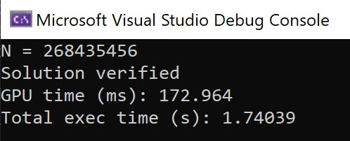

# A GPU-accelerated N-Queens solver

This program implements a linear time algorithm to generate *one* feasible solution to the N-Queens problem for all N. Generating *all* possible solutions for each value of N is an NP-Hard problem.

Since the individual placement of the queens are no longer interdependent, I was able to parallelize the algorithm using the CUDA API (just for fun). The result is an extremely fast solver, capable of solving for N = 268,435,456 in about 173 milliseconds. There is some overhead due to the data transfer between the host computer and the GPU, so the script takes a total of 1.7 seconds to run:

 

These numbers were achieved with a GTX 1060 GPU, which has 1,280 CUDA cores and 6GB of memory. The GPU has compute capability 6.1, and the code was compiled for CUDA 10.1. The (seemingly) arbitrary N value mentioned above is the maximum the GPU can handle before it runs out of memory. The board is represented by an N-element list of int32s such that board\[x\] = y. The occupancy map is given by 4 lists of short16s, each tracking the presence of a queen in each row, column, and both diagonals. This occupancy map is used for verification of the solution. However, a potential improvement is to use only one list of short16s (since CUDA C does not support bool lists) for the occupancy map, in order to reduce its memory requirement three-fold.  

The main code can be found in "kernel.cu".  

Right now, the only task pending is a way to push the solution array from the GPU back to my local machine in chunks. The built-in cudaMemcpy function seems to copy the solution array as one very long, linear byte sequence. As N becomes very large, the solution reaches several hundreds of megabytes to a few gigabytes, before we start hitting integer limits and cannot go any further.  

References:

- Mikhailovskii, Dmitrii. "New explicit solution to the N-Queens Problem and its relation to the Millennium Problem." arXiv preprint arXiv:1805.07329 (2018).

- Hoffman, E. J., et al. “Constructions for the Solution of the m Queens Problem.” Mathematics Magazine, vol. 42, no. 2, 1969, pp. 66–72. JSTOR, www.jstor.org/stable/2689192.

- Bernhardsson, Bo. “Explicit solutions to the N-queens problem for all N.” SGAR (1991).

